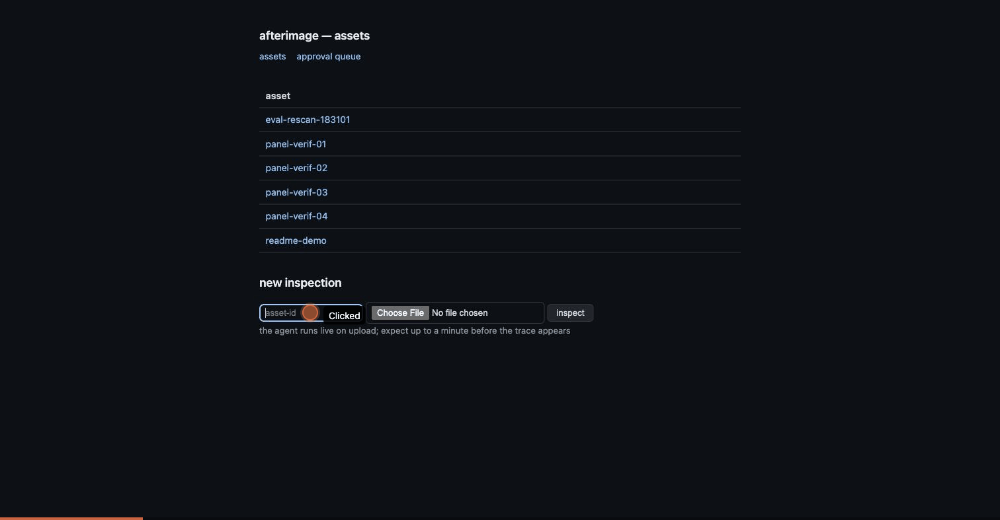
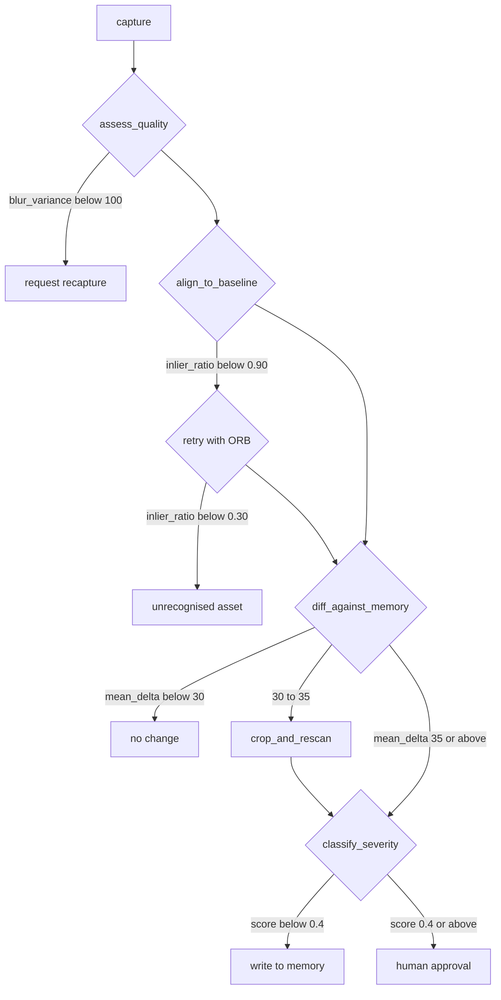
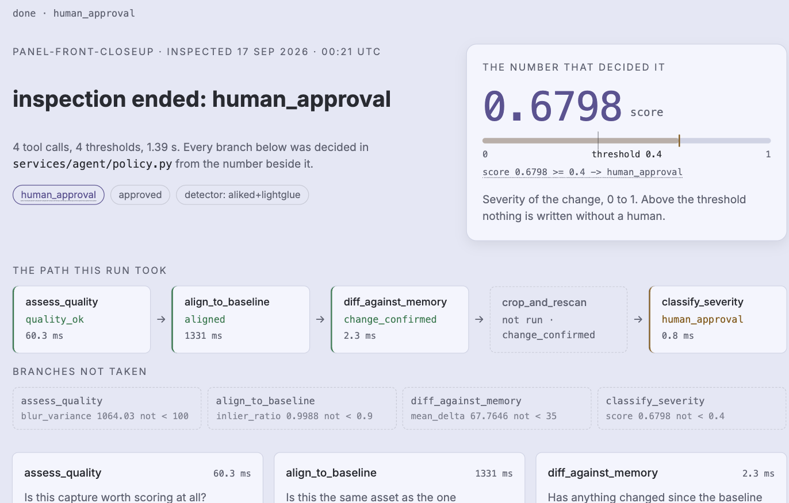
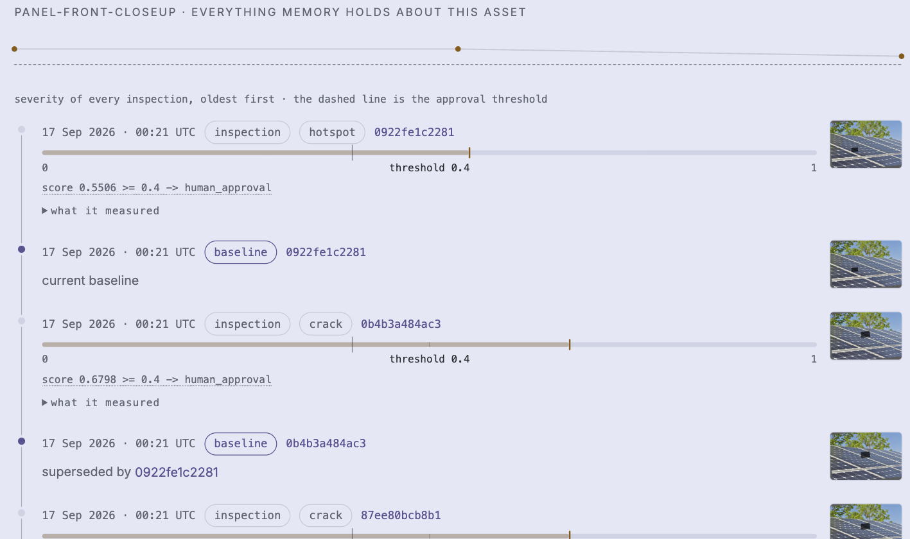
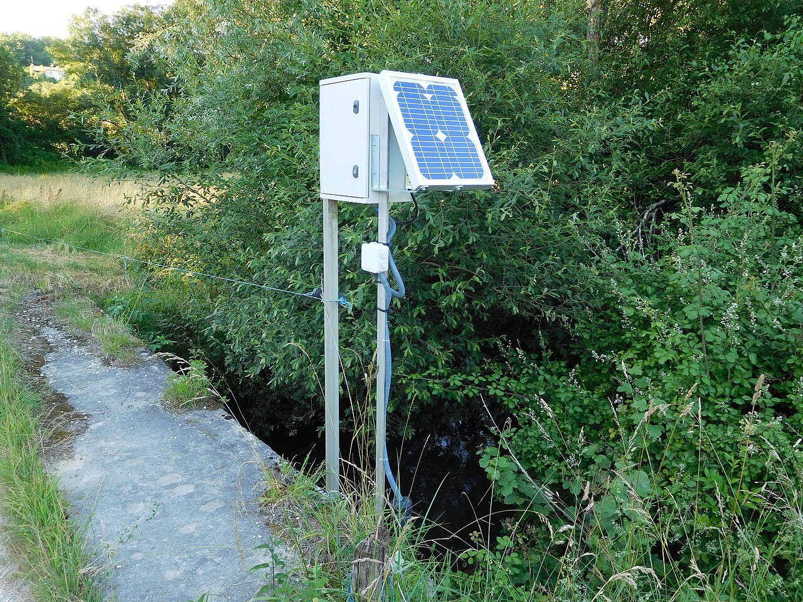
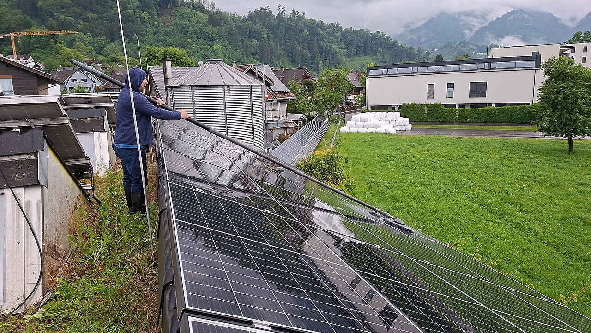
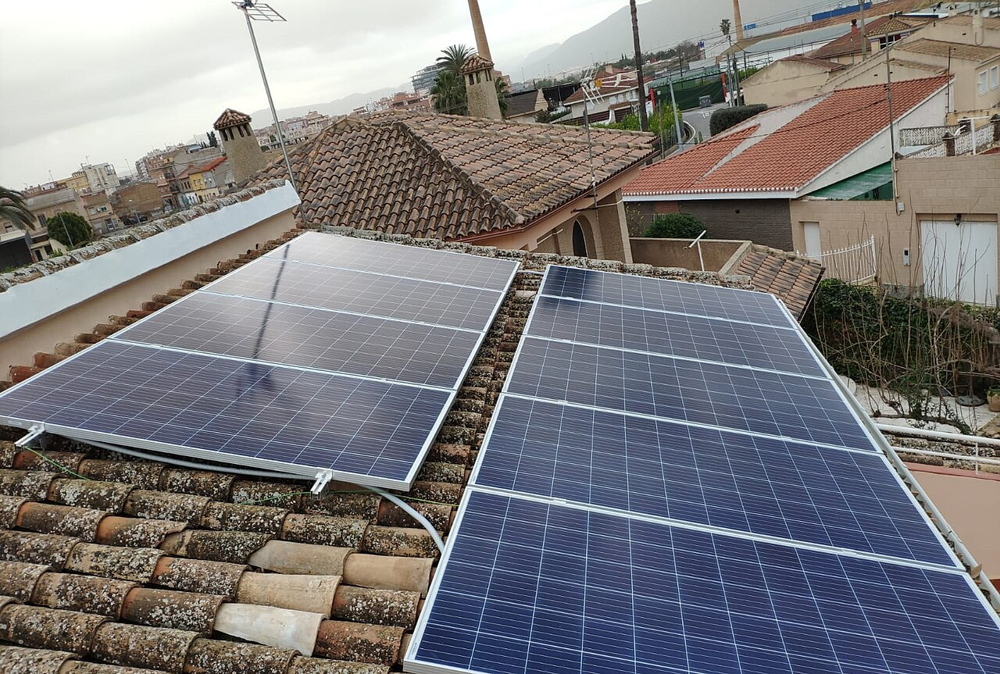

<h1 align="center">afterimage</h1>

<p align="center">
  <b>A visual inspection agent that remembers.</b><br>
  It inspects physical assets from photos or video, decides on its own what to look at next, and compares every capture against the memory of the same asset to detect degradation over time.
</p>

<p align="center">
  
  
  
  
  <a href="https://jgmzrkpa344jwixw7nbulgh2ju0mojcb.lambda-url.us-east-1.on.aws/"></a>
</p>

<p align="center">
  <b><a href="https://jgmzrkpa344jwixw7nbulgh2ju0mojcb.lambda-url.us-east-1.on.aws/">Try the live agent</a></b> ·
  <b><a href="https://youtu.be/zUFR96a33IM">Watch the demo (4:54)</a></b> ·
  <b><a href="https://gmassello.github.io/afterimage/">Field manual</a></b> ·
  <b><a href="docs/TECHNICAL_REPORT.md">Technical report</a></b> ·
  <b><a href="docs/EVALUATION.md">Evaluation</a></b>
</p>

<p align="center">
  <a href="https://jgmzrkpa344jwixw7nbulgh2ju0mojcb.lambda-url.us-east-1.on.aws/"></a><br>
  <sub>Upload a capture → the loop decides → the trace shows the value behind every decision</sub>
</p>

---

Built for the [OpenCV AI Competition 2026](https://opencv26.devpost.com/) — Agentic Vision path ([the submission](https://devpost.com/software/afterimage-ibp376)). Every branch below is decided in code by `services/agent/policy.py` and recorded with the numeric value that triggered it, so any run can be replayed from its trace.

[What it does](#what-it-does) · [Results](#results) · [How the loop works](#how-the-loop-works) · [Quickstart](#quickstart) · [The dataset](#the-dataset) · [Deploy](#deploy)

## What it does

- Gates its own input — a blurred or badly framed capture is sent back for a recapture instead of scored.
- Anchors each capture to the stored baseline of the same asset with OpenCV 5 `Features` (ALIKED + LightGlue), or refuses the asset when alignment fails.
- Diffs against memory and zooms in on its own when a region is uncertain, rather than reporting a maybe.
- Escalates a severe finding to a human approval queue before anything is written to memory.
- Emits every decision as a trace event carrying the metric, the threshold and the branch it produced.

The loop is the product, not the development process: an unusable capture is sent back, an unrecognised asset is refused rather than guessed, and a severe finding waits for a human before anything is written.

## Results

23 scenarios — 11 synthetic, 12 on licensed photographs of real photovoltaic modules. **20 pass** every assertion: branch, defect class and required decision path. Reproduce with `make eval`; the test suite fails if these figures drift from `eval/results/latest/results.json`.

| Metric | Score | Measured over |
|:---|---:|:---|
| Branch accuracy | 0.8696 | 23 scenarios, macro F1 0.8815 |
| Defect macro F1 | 0.9513 | precision 1.0 on every defect class |
| Mean IoU | 0.8258 | 10 localised regions, 9 at IoU ≥ 0.5 |
| Scenarios passed | 20 / 23 | 12 of them on real photographs |

### Where it fails

| Scenario | Got instead | Deciding number |
|---|---|---|
| `recapture-partial-frame-synthetic` | unrecognized_asset | `inlier_ratio 0.0602 vs 0.3` |
| `hotspot-real-plain` | recapture / NONE | `clipped_bright_ratio 0.3086 vs 0.3` |
| `delamination-real-packed` | auto_write | `score 0.3412 vs 0.4` |

Each of the three is traced to a root cause in [the evaluation](docs/EVALUATION.md) — a coverage gate that cannot take one global default, an exposure gate firing before severity is ever assessed, and a severity score that ignores the class the classifier just produced.

## How the loop works



<sub>Every arrow is a threshold in `policy.py`, and every run records the value that took it</sub>

Perception runs in an arm64 OpenCV 5 container on Lambda (Graviton): capture quality, baseline alignment (OpenCV 5 `Features` — ALIKED + LightGlue, ORB as fallback), diffing against memory, crop-and-rescan, defect severity. Memory is a single DynamoDB table returning an asset's whole history in one query, with images in S3 and a baseline that is superseded rather than overwritten. An LLM (Gemini over MCP) orders the tool calls; it cannot move a threshold.

| Trace viewer | Asset history |
|---|---|
|  |  |
| One span per tool call, with the value that triggered the branch. | Every inspection of an asset, and which capture is the baseline. |

## Quickstart

Docker with Compose v2 (arm64 host or emulation) and `make`. Nothing else installs locally.

1. Download the ALIKED and LightGlue ONNX weights (52 MB, sha1 verified)

   ```bash
   make weights
   ```

2. Build the image and start the local stack (LocalStack S3 + DynamoDB)

   ```bash
   make dev
   ```

3. Drive the loop through all four action branches

   ```bash
   make demo
   ```

4. Score the agent over the 23 scenarios

   ```bash
   make eval   # writes eval/results/latest/
   ```

> [!TIP]
> `make demo` runs a scripted driver. To let Gemini orchestrate the same loop over MCP, add `GOOGLE_API_KEY` to the environment and run `docker-compose run --rm app python -m services.agent.demo --live`. Either way the branch verdicts are computed in code.

## The dataset

Twelve Wikimedia Commons photographs of photovoltaic modules, committed under `eval/dataset/base/` so `make eval` is offline and deterministic. Author and licence for each are listed in `eval/dataset/SOURCES.md`. Defects are injected, which is what makes the ground truth exact — and what makes this a test of threshold robustness on real texture, not a field trial.

| Module, close range | Soiling | Rooftop array |
|---|---|---|
|  |  |  |

## Deploy

One arm64 Lambda container image behind a Function URL: FastAPI serves the site and runs the agent loop inside the request. Run artefacts persist under `runs/` in the app bucket, so traces survive redeploys and cold sandboxes.

```bash
GOOGLE_API_KEY=... make deploy   # ECR + docker buildx arm64 + CloudFormation, idempotent
```

| Endpoint | What it serves |
|---|---|
| `/` | Asset list and capture upload |
| `/assets/{id}` | Inspection history and current baseline |
| `/queue` | Human approval queue |
| `/traces/{run_id}` | Per-run trace, JSON or HTML |
| `/health` | Health check |

<details>
<summary>Deploy internals — one-time OIDC bootstrap and repo configuration</summary>

The Deploy workflow authenticates with GitHub's OIDC provider under a permissions boundary, so no long-lived AWS keys live in the repository. Bootstrap once:

```bash
# immutable IDs for the OIDC sub claim (already baked into the template default)
gh api repos/gmassello/afterimage --jq '{repo_id: .id, owner_id: .owner.id}'

aws cloudformation deploy --template-file infra/github-oidc.yaml \
    --stack-name afterimage-github-oidc --capabilities CAPABILITY_NAMED_IAM
```

Then set `secrets.AWS_ROLE_ARN` (the `RoleArn` output), `secrets.GOOGLE_API_KEY` and `vars.AWS_REGION`, and run Actions → Deploy. The deploy prints the public URL.

</details>

## Project log

Eight weeks, one capability per week. Current stage: **the written record** — the technical report, the diagrams and the five-minute video script.

<details>
<summary>Week by week — perception, memory, the agent, observability, the public endpoint, evaluation, the report</summary>

| Week | What landed |
|---|---|
| 8 | The written record: technical report with both required diagrams, the degradation literature, measured limits, and a timed video script. Headline figures asserted against the eval artefact by the test suite. |
| 7 | Evaluation: 23 declarative scenarios scored against the real loop. Verdicts owed — the severity heuristic holds; `coverage_ratio_min` cannot take one global default. |
| 6 | The public endpoint: upload, live loop, approval queue and asset history, deployed by IaC through GitHub OIDC. |
| 5 | Observability: one span per tool call persisted per run and served as JSON or a readable page. |
| 4 | The agent: five perception tools over MCP, an LLM ordering the calls, and `policy.py` deciding every branch in code. |
| 3 | Memory: one DynamoDB table returning an asset's whole history, images in S3, baselines superseded rather than overwritten. |
| 2 | Perception: the five tools implemented and tested on synthetic fixtures, each returning the raw metrics the agent branches on. |

Progress against the competition rubric is tracked in [docs/SUBMISSION.md](docs/SUBMISSION.md); the full brief and weekly plan live in [docs/BRIEF.md](docs/BRIEF.md).

</details>

---

<p align="center"><sub>MIT © 2026 · Built for the OpenCV AI Competition 2026 · <a href="https://gmassello.github.io/afterimage/">Field manual</a></sub></p>
