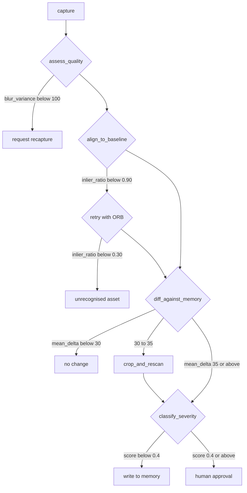

<h1 align="center">afterimage</h1>

<p align="center">
  <b>A visual inspection agent that remembers.</b><br>
  It inspects physical assets from photos or video, decides on its own what to look at next, and compares every capture against the memory of the same asset to detect degradation over time.
</p>

<p align="center">
  
  
  
  
  <a href="https://jgmzrkpa344jwixw7nbulgh2ju0mojcb.lambda-url.us-east-1.on.aws/"></a>
</p>

<p align="center">
  <b><a href="https://jgmzrkpa344jwixw7nbulgh2ju0mojcb.lambda-url.us-east-1.on.aws/">Try the live agent</a></b> — no login, <b>200 in 0.58 s</b> ·<br>
  <b><a href="https://youtu.be/zUFR96a33IM">Watch the demo (4:54)</a></b> ·
  <b><a href="https://gmassello.github.io/afterimage/">Field manual</a></b> ·
  <b><a href="docs/TECHNICAL_REPORT.md">Technical report</a></b> ·
  <b><a href="docs/EVALUATION.md">Evaluation</a></b> ·
  <b><a href="docs/RESPONSIBLE_USE.md">Responsible use</a></b> ·
  <b><a href="docs/SECURITY.md">Security</a></b> ·
  <b><a href="docs/AI_DISCLOSURE.md">AI use</a></b>
</p>

Developer documentation: [functional guide](docs/FUNCTIONAL.md) ·
[technology stack](docs/STACK.md) · [architecture](docs/ARCHITECTURE.md) ·
[backend](docs/BACKEND.md) · [frontend](docs/FRONTEND.md)

<p align="center">
  <sub>Response time is the median of seven warm requests to the Function URL, measured with <code>curl -o /dev/null -w '%{http_code} %{time_total}'</code> on 15 September 2026 (range 0.57–0.67 s). It is a warm figure: an EventBridge rule replays a synthetic <code>/health</code> every five minutes. Cold, the function itself takes <b>2.34 s</b> to start — the median of 211 cold starts in the fortnight of logs the group holds — on top of that same network time. An inspection takes <b>22.8 s</b> and bills <b>$0.0006</b> at list price. <a href="docs/TECHNICAL_REPORT.md#7-deployment-and-responsible-operation">Where each figure comes from</a>.</sub>
</p>

<p align="center">
  <a href="https://jgmzrkpa344jwixw7nbulgh2ju0mojcb.lambda-url.us-east-1.on.aws/"></a><br>
  <sub>Upload a capture → the loop decides → the trace shows the value behind every decision → a human approves what the policy would not write alone</sub><br>
  <sub><a href="https://youtu.be/zUFR96a33IM">Watch the 5-minute walkthrough</a> · <a href="https://jgmzrkpa344jwixw7nbulgh2ju0mojcb.lambda-url.us-east-1.on.aws/">try the live endpoint</a></sub>
</p>

---

Built for the [OpenCV AI Competition 2026](https://opencv26.devpost.com/) — Agentic Vision path ([the submission](https://devpost.com/software/afterimage-ibp376)). Every branch below is decided in code by `services/agent/policy.py` and recorded with the numeric value that triggered it, so any run can be replayed from its trace.

**Two of the APIs this project runs on do not exist in OpenCV 4** — it cannot be ported back to 4.x by changing an import.

| OpenCV 5 API | What it does here | In OpenCV 4 |
|---|---|---|
| `cv2.ALIKED.create` | learned keypoints on every capture and on the stored baseline of the same asset | no equivalent — `Features2D` ships no learned detector |
| `cv2.LightGlueMatcher.create` + `setPairInfo` | matches those keypoints with geometry-aware attention over the image pair | no equivalent — only `BFMatcher` / `FLANN` descriptor distance |

Both live in [`services/perception/alignment.py`](services/perception/alignment.py), inside the `Features` module that replaced `Features2D` in 5.x. They are load-bearing, not decorative: on the same pair of panel images — same panel, rotated and scaled — ALIKED + LightGlue scores `inlier_ratio` **0.997** where ORB scores **0.409**, which is why the policy carries one alignment threshold per detector instead of a shared one.

[What it does](#what-it-does) · [Results](#results) · [How the loop works](#how-the-loop-works) · [Quickstart](#quickstart) · [The dataset](#the-dataset) · [Deploy](#deploy)

## What it does

- Gates its own input — a blurred or badly framed capture is sent back for a recapture instead of scored.
- Anchors each capture to the stored baseline of the same asset with OpenCV 5 `Features` (ALIKED + LightGlue), or refuses the asset when alignment fails.
- Diffs against memory and zooms in on its own when a region is uncertain, rather than reporting a maybe.
- Escalates a severe finding to a human approval queue before anything is written to memory.
- Emits every decision as a trace event carrying the metric, the threshold and the branch it produced, hash-chained to the event before it — `GET /traces/{run_id}` names the event where an edit broke the chain. The chain proves no step was edited on its own, not that the file as a whole was not rewritten; see [docs/SECURITY.md](docs/SECURITY.md).

The loop is the product, not the development process: an unusable capture is sent back, an unrecognised asset is refused rather than guessed, and a severe finding waits for a human before anything is written.

The public landing explains the problem, the decision loop, measured evidence, stack and limits before asking anyone to operate the system. The `/app` workspace includes four sample captures of the same panel, written to a demo asset of the visitor's own, so anyone can drive the whole loop without a photo of their own; `/activity` makes the latest runs searchable by identity and outcome. Three switches sit beside each other in the header: language (English or Spanish), register (plain or technical) and theme. The plain register explains the number a decision turned on; it never replaces it, and metric names, identifiers and the message the agent itself wrote stay as the trace recorded them.

A failed run remains immutable and can be retried from recent activity, and a run interrupted before it finished is closed as failed after fifteen minutes of silence so it can be retried too. The retry creates a new run over the same capture, repeated requests return that same replacement, and a write-once marker preserves the relationship. Browser failures render as normal themed pages; API clients receive stable `{detail, code, retryable}` JSON.

## Results

29 scenarios — 11 synthetic, 18 on licensed photographs of real photovoltaic modules. **24 pass** every assertion: branch, defect class and required decision path. Reproduce with `make eval`; the test suite fails if these figures drift from `eval/results/latest/results.json`.

| Metric | Score | Measured over |
|:---|---:|:---|
| Real photographs | 18 / 29 | the majority of the suite runs on photographs, not on generated panels |
| Branch accuracy | 0.8621 | 29 scenarios, macro F1 0.8624 |
| Defect macro F1 | 0.8753 | precision 0.75 or better on every defect class |
| Mean IoU | 0.7875 | 14 localised regions, 12 at IoU ≥ 0.5 |
| Scenarios passed | 24 / 29 | 14 real-photograph and 10 synthetic scenarios |

### Where it fails

| Scenario | Got instead | Deciding number |
|---|---|---|
| `recapture-partial-frame-synthetic` | unrecognized_asset | `inlier_ratio 0.0602 vs 0.3` |
| `recapture-partial-frame-real-arapaho` | unrecognized_asset | `inlier_ratio 0.1232 vs 0.3` |
| `hotspot-real-plain` | recapture / NONE | `clipped_bright_ratio 0.3086 vs 0.3` |
| `delamination-real-packed` | auto_write | `score 0.3412 vs 0.4` |
| `soiling-real-forest` | human_approval / hotspot | `area_ratio 0.076 vs 0.25` |

Each of the five is traced to a root cause in [the evaluation](docs/EVALUATION.md) — a coverage gate that cannot take one global default, an exposure gate firing before severity is ever assessed, a severity score that ignores the class the classifier just produced, and a soiling rule whose area threshold was calibrated on the synthetic panel and does not survive real texture. The two partial-frame rows are the same root cause seen twice: once on a generated panel and once on a photograph.

## How the loop works



<sub>Every arrow is a threshold in `policy.py`, and every run records the value that took it</sub>

Perception runs in an arm64 OpenCV 5 container on Lambda (Graviton): capture quality, baseline alignment (OpenCV 5 `Features` — ALIKED + LightGlue, ORB as fallback), diffing against memory, crop-and-rescan, defect severity. Memory is a single DynamoDB table returning an asset's whole history in one query, with images in S3 and a baseline that is superseded rather than overwritten. An LLM (Gemini over MCP) orders the tool calls; it cannot move a threshold.

| Trace viewer | Asset history |
|---|---|
|  |  |
| One span per tool call, with the value that triggered the branch. | Every inspection of an asset, and which capture is the baseline. |

## Quickstart

Docker with Compose v2 (arm64 host or emulation) and `make`. Nothing else installs locally.

1. Download the ALIKED and LightGlue ONNX weights (52 MB, sha1 verified)

   ```bash
   make weights
   ```

2. Build the image and start the local stack (LocalStack S3 + DynamoDB)

   ```bash
   make dev
   ```

3. Drive the loop through all four action branches

   ```bash
   make demo
   ```

4. Score the agent over the 29 scenarios

   ```bash
   make eval   # writes eval/results/latest/
   ```

> [!TIP]
> `make demo` runs a scripted driver. To let Gemini orchestrate the same loop over MCP, add `GOOGLE_API_KEY` to the environment and run `docker-compose run --rm app python -m services.agent.demo --live`. Either way the branch verdicts are computed in code.

## The dataset

Eighteen Wikimedia Commons photographs of photovoltaic modules, committed under `eval/dataset/base/` so `make eval` is offline and deterministic. Author and licence for each are listed in `eval/dataset/SOURCES.md`. Defects are injected, which is what makes the ground truth exact — and what makes this a test of threshold robustness on real texture, not a field trial.

| Module, close range | Soiling | Rooftop array |
|---|---|---|
|  |  |  |

## Deploy

One arm64 Lambda container image behind a Function URL: FastAPI serves the site and runs the agent loop inside the request. Run artefacts persist under `runs/` in the app bucket, so traces survive redeploys and cold sandboxes.

```bash
GOOGLE_API_KEY=... make deploy   # ECR + docker buildx arm64 + CloudFormation, idempotent
```

| Endpoint | What it serves |
|---|---|
| `/` | Public landing: product, workflow, measured evidence, stack and limits |
| `/app` | Asset list, capture upload and four sample captures that need no file of your own |
| `/activity` | Search and status filtering over the latest 50 runs |
| `/assets/{id}` | Inspection timeline and current baseline |
| `/queue` | Human approval queue, with the compared pair |
| `/traces/{run_id}` | Per-run trace, JSON or HTML; fills in live while the run works |
| `/runs/{run_id}/execute` | Runs the agent loop for a trace the upload already opened |
| `/runs/{run_id}/retry` | Idempotently opens the replacement for a terminal failed run |
| `/health` | Health check |

<details>
<summary>Deploy internals — one-time OIDC bootstrap and repo configuration</summary>

The Deploy workflow authenticates with GitHub's OIDC provider into a role scoped to this stack's own resources, so no long-lived AWS keys live in the repository. Bootstrap once:

```bash
# immutable IDs for the OIDC sub claim (already baked into the template default)
gh api repos/gmassello/afterimage --jq '{repo_id: .id, owner_id: .owner.id}'

aws cloudformation deploy --template-file infra/github-oidc.yaml \
    --stack-name afterimage-github-oidc --capabilities CAPABILITY_NAMED_IAM
```

Then set `secrets.AWS_ROLE_ARN` (the `RoleArn` output), `secrets.GOOGLE_API_KEY` and `vars.AWS_REGION`, and run Actions → Deploy. The deploy prints the public URL.

</details>

## Project log

Eight weeks, one capability per week. Current stage: **the written record** — the technical report, the diagrams and the five-minute video script.

<details>
<summary>Week by week — perception, memory, the agent, observability, the public endpoint, evaluation, the report</summary>

| Week | What landed |
|---|---|
| 8 | The written record: technical report with both required diagrams, the degradation literature, measured limits, and a timed video script. Headline figures asserted against the eval artefact by the test suite. |
| 7 | Evaluation closed initially with 23 declarative scenarios; the current suite has 29. Verdicts owed — the severity heuristic holds; `coverage_ratio_min` cannot take one global default. |
| 6 | The public endpoint: upload, live loop, approval queue and asset history, deployed by IaC through GitHub OIDC. |
| 5 | Observability: one span per tool call persisted per run and served as JSON or a readable page. |
| 4 | The agent: five perception tools over MCP, an LLM ordering the calls, and `policy.py` deciding every branch in code. |
| 3 | Memory: one DynamoDB table returning an asset's whole history, images in S3, baselines superseded rather than overwritten. |
| 2 | Perception: the five tools implemented and tested on synthetic fixtures, each returning the raw metrics the agent branches on. |

Progress against the competition rubric is preserved in [docs/SUBMISSION.md](docs/SUBMISSION.md).
The original [brief](docs/BRIEF.md) and [build plan](docs/PLAN.md) are historical records; use the
[architecture guide](docs/ARCHITECTURE.md) for the implemented system.

</details>

---

<p align="center"><sub>MIT © 2026 · Built for the OpenCV AI Competition 2026 · <a href="https://gmassello.github.io/afterimage/">Field manual</a><br>The front end ships the Inter typeface, used under the SIL Open Font License 1.1 — see <a href="NOTICE">NOTICE</a>.</sub></p>
