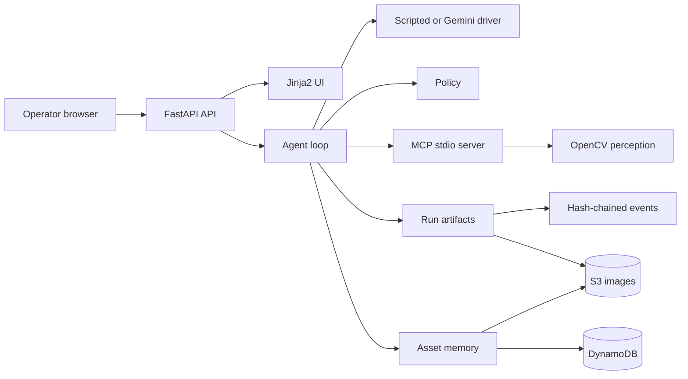
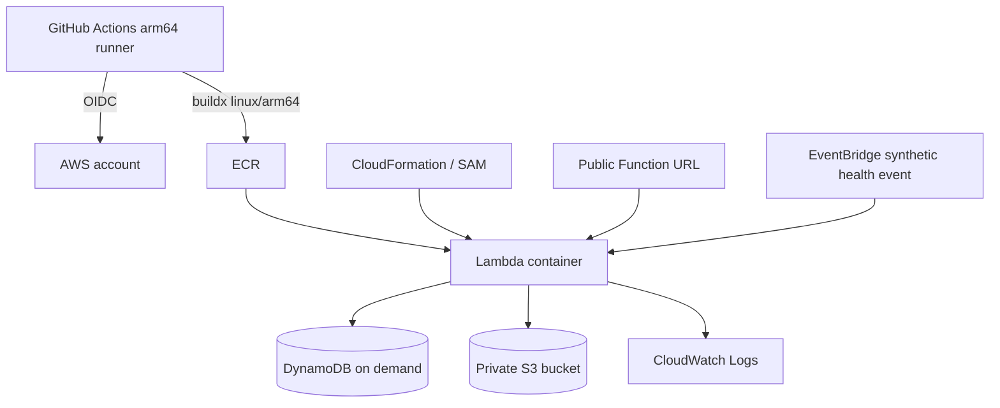

# Architecture

This document is the canonical architecture description of the implemented system. `BRIEF.md` and
`PLAN.md` are historical planning records and must not be used as descriptions of the current
runtime.

## System shape

Afterimage is a modular monolith shipped as one `arm64` container. One FastAPI process serves the
HTML interface, HTTP endpoints, inspection loop, approval gate, and trace viewer. Perception is
exposed to the loop through an MCP stdio subprocess, but it is not a separately deployed service.



## Module boundaries

| Module | Responsibility | Must not own |
|---|---|---|
| `services/api/` | HTTP validation, content negotiation, redirects, and route orchestration | Perception thresholds or image analysis |
| `services/ui/` | View-model construction, translation, HTML templates, and browser assets | Persistence and branch decisions |
| `services/agent/` | Tool sequencing, model adapter, policy evaluation, and human gate | Raw OpenCV implementation |
| `services/mcp_server/` | MCP tool contracts using storage keys | Product policy |
| `services/perception/` | Numeric image measurements | Branch verdicts |
| `services/memory/` | Asset history, baselines, images, and run-artifact storage | UI rendering |
| `services/observability/` | Append-only events, integrity chain, and trace rendering helpers | Business persistence |

The critical boundary is between measurement and decision. Perception may use thresholds supplied
by `Policy` to construct regions or features, but it reports measurements rather than product
verdicts. Only `services/agent/policy.py:evaluate` converts stage metrics into a branch.

## Inspection sequence

```mermaid
sequenceDiagram
    actor Operator
    participant Browser
    participant API
    participant Loop
    participant MCP
    participant Policy
    participant Memory

    Operator->>Browser: Enter /app and choose asset and capture
    Browser->>API: POST /inspections
    API->>Memory: Store capture and run_started
    API-->>Browser: 303 /traces/{run_id}
    Browser->>API: POST /runs/{run_id}/execute
    API->>Loop: Resume claimed run
    Loop->>MCP: Run required perception tool
    MCP-->>Loop: Numeric metrics
    Loop->>Policy: evaluate(stage, metrics, policy)
    Policy-->>Loop: Metric, value, threshold, branch
    Loop->>Memory: Append trace event
    alt accepted result
        Loop->>Memory: Store inspection and maybe promote baseline
    else severe result
        Loop->>Memory: Store pending approval
    end
    API-->>Browser: Terminal state
```

`GET /` is a read-only public landing page. The operational surfaces start at `GET /app`; recent
run discovery lives at `GET /activity`. Both stay in the same FastAPI/Jinja2 process and share the
same static assets, preferences, and storage adapters.

For an asset without a baseline, the loop runs quality assessment and either requests a recapture
or creates the first baseline. For an existing asset, the enforced order is quality, initial
alignment, diff, optional crop-and-rescan, and severity. Alignment starts with ALIKED and LightGlue
when weights are available and may retry with ORB; without weights it starts with ORB and does not
perform that retry. The driver can choose arguments and phrasing, but `NEXT_TOOL`, policy validation,
and the final submit contract prevent it from skipping stages or changing the branch.

## Data architecture

### Asset memory

One DynamoDB partition represents an asset:

| Key | Content |
|---|---|
| `pk=ASSET#<id>`, `sk=META` | Asset summary and latest inspection fields used by the gallery. |
| `pk=ASSET#<id>`, `sk=INSPECTION#<timestamp>#<id>` | Immutable inspection result, metrics, and verdict. |
| `pk=ASSET#<id>`, `sk=BASELINE#<timestamp>` | Baseline record and supersession relationship. |

Images use `assets/{asset_id}/{inspection_id}/{name}.png` in S3. A baseline is added and the
previous one is marked as superseded; image objects are not overwritten.

### Run artifacts

Runs are stored on the local filesystem or in S3 under `runs/{run_id}/`:

- `events.json` is the logically append-only causal event stream and source for in-progress state.
- `state.json` stores the terminal summary.
- `pending.json` stores a finding waiting for human approval.
- `retry.json` on a failed run points to its replacement run, so concurrent or repeated retry
  requests converge on one result rather than creating a retry tree.

Each trace event includes the previous hash and its own SHA-256 hash. Verification detects common
editing, reordering, or removal inside the chain. It does not provide signatures, an external trust
anchor, protection against full rehashing, or proof that the final event was not truncated.

## Deployment



The Lambda Web Adapter connects the Function URL to Uvicorn. The same container handles short page
requests and the long inspection request. There is no external queue or independent worker.

## Architectural guarantees and limits

- Policy owns every product threshold; perception never returns a branch.
- ALIKED and LightGlue are the primary alignment path, with ORB as a detector-specific fallback.
- Severe findings cannot update asset memory before a human decision.
- Baseline promotion is timestamp-aware, so an older capture cannot replace a newer reference.
- Run claiming is explicit but not atomic across competing workers.
- A failed-run retry creates a new `unstarted` run with the original asset and capture. It never
  appends to or executes the failed run, and repeated requests return the recorded replacement.
- HTTP failures have stable machine-readable codes. Content negotiation renders the same failure as
  HTML for browsers or `{detail, code, retryable}` JSON for API clients.
- Inspection and `META` summary updates are not a DynamoDB transaction.
- Asset scans and history queries do not implement full pagination.
- In-process image and asset caches are not bounded.

See [BACKEND.md](BACKEND.md) for contracts and failure behavior, [FRONTEND.md](FRONTEND.md) for the
browser architecture, and [SECURITY.md](SECURITY.md) for trust boundaries.
