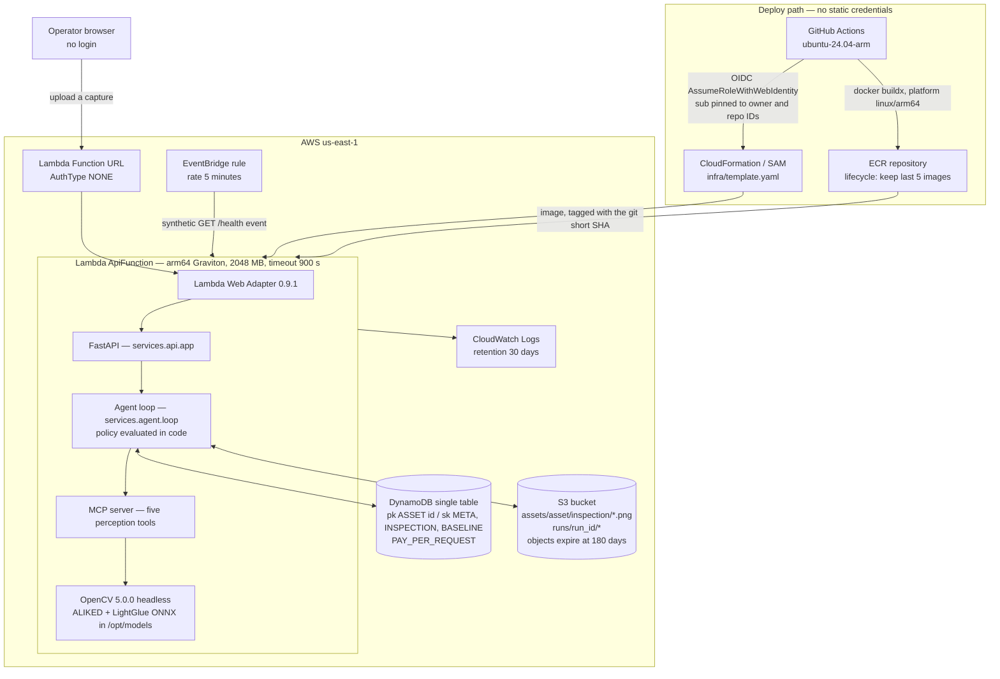
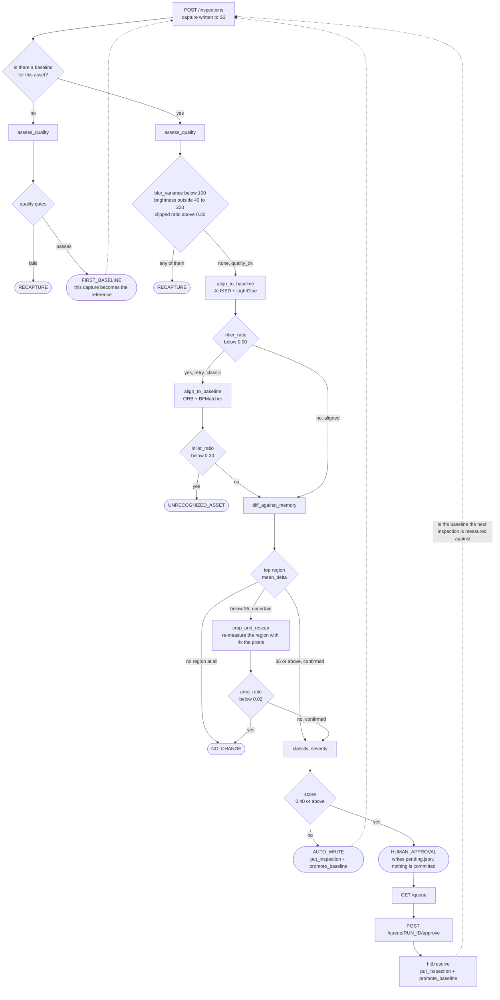

# afterimage — technical report

> This report presents the competition case and its evidence. For maintainers, the current system
> is split into the [functional](FUNCTIONAL.md), [stack](STACK.md),
> [architecture](ARCHITECTURE.md), [backend](BACKEND.md), and [frontend](FRONTEND.md) guides.

A visual inspection agent with longitudinal memory, built for the
[OpenCV AI Competition 2026](https://opencv26.devpost.com/) (Agentic Vision path).

**Live agent:** <https://jgmzrkpa344jwixw7nbulgh2ju0mojcb.lambda-url.us-east-1.on.aws/> — no login.
**Field manual:** <https://gmassello.github.io/afterimage/> · **Source:** <https://github.com/gmassello/afterimage>

This report is self-contained on the system itself: problem, users, architecture, the OpenCV 5
implementation, the agentic loop, the AWS deployment, what was measured and where it fails.
Responsible use, security and the use of AI have their own documents, linked from §7. Every number in it is either
produced by `make eval` and stored in `eval/results/latest/results.json`, read from a file in this
repository and cited with its path, or taken from a public source listed with its URL.

**Two of the APIs this project runs on do not exist in OpenCV 4** — it cannot be ported back to 4.x
by changing an import.

| OpenCV 5 API | What it does here | In OpenCV 4 |
|---|---|---|
| `cv2.ALIKED.create` | learned keypoints on every capture and on the stored baseline of the same asset | no equivalent — `Features2D` ships no learned detector |
| `cv2.LightGlueMatcher.create` + `setPairInfo` | matches those keypoints with geometry-aware attention over the image pair | no equivalent — only `BFMatcher` / `FLANN` descriptor distance |

Both live in `services/perception/alignment.py`, inside the `Features` module that replaced
`Features2D` in 5.x. They are load-bearing, not decorative: on the same pair of panel images ALIKED +
LightGlue scores `inlier_ratio` **0.997** where ORB scores **0.409**, which is why the policy carries
one alignment threshold per detector. [Section 5](#5-the-opencv-5-implementation) has the rest of
the OpenCV 5 surface and the three behaviours measured against the running binary.

---

## 1. The problem, and who has it

A utility-scale photovoltaic plant is a field of near-identical objects that degrade slowly and
independently. Solar Star, in California, is 579 MW across roughly **1.7 million modules** — about
2,900 modules per MW.<sup>[1]</sup> At that ratio a modest 100 MW plant carries on the order of
290,000 individual assets, each of which can crack, delaminate, develop a hot spot or simply get
dirty, and each of which is worth a few hundred dollars.

The people who have this problem are plant O&M technicians and asset owners. Their working question
is not "is this module defective?" It is **"has this module changed since the last time we looked at
it?"** — because that is the question that separates a scratch that has been there since
commissioning from a crack that appeared last quarter and is spreading.

Existing automated inspection answers the first question. It classifies one frame in isolation
against a generic notion of a healthy panel. That is a fundamentally harder problem than the one the
technician actually has, and it throws away the single most informative thing available: what this
exact panel looked like three months ago.

## 2. Why change over time is the right thing to measure

The published failure literature describes degradation as a **curve, not an event**. A defect that
is harmless today is frequently the early state of one that is not:

| Failure mode | What the literature reports | Source |
|---|---|---|
| Cell microcracks | A crack separating **less than 8% of the cell area causes no immediate power loss** — but thermal and humidity cycling can raise the crack's resistance over time, turning a benign crack into a real one. Early classification is what distinguishes the two. | Köntges et al., 2011<sup>[2]</sup> |
| Potential-induced degradation (PID) | Mean degradation of about **15%/year in affected modules**. The curve is sigmoidal — slow, then fast, then saturating — and the damage is **partially reversible** if the plant intervenes before saturation. | IEA-PVPS T13-09:2017<sup>[3]</sup> |
| Cell cracks | Under 3%/year system-wide, but up to roughly **7–8%/year in the affected portion** in cold and snow-load climates. | IEA-PVPS T13-09:2017<sup>[3]</sup> |
| Delamination | **Power loss above 10%** where it occurs; about 5% of failures registered within two years of delivery. | IEA-PVPS T13-09:2017<sup>[3]</sup> |
| Failed bypass diode | 11%/year in hot-dry and 25%/year in moderate climates for affected modules. A shorted diode in a three-diode module removes **one third of its output**, and an open one is invisible until the module is shaded — at which point it can produce hot spots and a fire risk. | IEA-PVPS T13-09:2017<sup>[3]</sup> |
| Soiling | **5–20% annual energy loss depending on site.** Arizona measured −1.2% in a wet year against −3.6% in a dry one; a Saudi site lost 1.4%/year under weekly cleaning and up to 8% at once after a sandstorm. | IEA-PVPS T13-09:2017<sup>[3]</sup> |
| Overall module degradation | Median **0.5–0.6%/year**, mean 0.8–0.9%/year across the published corpus. | Jordan et al., 2016<sup>[4]</sup> |

Read together, these say the same thing four different ways: **the value of an observation is in its
delta against the previous observation of the same physical object.** A 15%/year PID curve caught
before saturation is recoverable; caught after, it is not. A microcrack under the 8% threshold is a
thing to watch, and "watch" is a longitudinal verb.

### What we did not find, and are not going to invent

We looked for a published figure quantifying the **money saved by early detection** and there is
none we could verify. The primary literature documents the mechanism — what happens to a defect left
alone — not the return on catching it. The only inspection-cost figures we found in accessible form
come from the blogs of vendors who sell inspection services, which is a conflict of interest, and
two NREL and EPRI cost reports we could identify but not open to verify line by line. **None of them
are cited here.** A fabricated ROI number would be the easiest thing in this report to disprove.

What we can state is our own measured cost, because we own those numbers: alignment runs in about
**1.5 s per image pair** on CPU, and the AWS account carrying this stack billed **$0.0138** in
August. afterimage itself adds about **$0.10/month**, nearly all of it ECR storage for the five
retained arm64 images — 0.99 GB compressed, not the 2 GB the image measures unpacked. Lambda stays
inside the perpetual free tier even with a warmer firing every five minutes: the function billed
**2,381 GB-s** over the fortnight measured in §7, against 400,000 free every month.

<sub>
[1] Solar Star, 579 MW / ~1.7 million modules — <https://en.wikipedia.org/wiki/Solar_Star>. Press-grade
source, adequate for order of magnitude, not an engineering citation.<br/>
[2] M. Köntges, I. Kunze, S. Kajari-Schröder, X. Breitenmoser, B. Bjørneklett, "The risk of power loss
in crystalline silicon based photovoltaic modules due to micro-cracks", <i>Solar Energy Materials and
Solar Cells</i> 95(4):1131–1137, 2011 — <https://www.sciencedirect.com/science/article/abs/pii/S0927024810006606><br/>
[3] M. Köntges et al., IEA-PVPS T13-09:2017, "Assessment of Photovoltaic Module Failures in the
Field", May 2017 — <https://iea-pvps.org/wp-content/uploads/2017/09/170515_IEA-PVPS-report_T13-09-2017_Internetversion_2.pdf><br/>
[4] D. C. Jordan, S. R. Kurtz, K. VanSant, J. Newmiller, "Compendium of photovoltaic degradation
rates", <i>Prog. Photovolt: Res. Appl.</i> 24(7):978–989, 2016, as cited in IEA-PVPS T13-30:2025 —
<https://www.iea-pvps.org/wp-content/uploads/2025/02/IEA-PVPS-T13-30-2025-REPORT-Degradation-and-Failure.pdf>
</sub>

## 3. What makes this different: longitudinal memory

afterimage does not ask "does this look like a broken panel?" It asks **"what changed since the last
time I saw this exact panel?"**

Every capture is aligned to the stored baseline of the **same asset**, diffed against it, and the
result is written back as the new baseline once a human or the policy accepts it. Memory is not a
cache in front of a classifier — it is the reference the measurement is taken against. Remove it and
there is nothing to measure.

Concretely, in `services/memory/store.py`, one DynamoDB partition holds an asset's whole life:

| Sort key | What it is |
|---|---|
| `META` | the asset |
| `INSPECTION#{captured_at}#{inspection_id}` | one capture, the metrics measured on it, and the `verdict` it was judged by — the metric, the value and the **threshold in force when it ran**, so moving a threshold never relabels the past |
| `BASELINE#{captured_at}` | the current reference, gaining a `superseded_by` field when a newer one replaces it. A capture older than the one in force is filed with that field already set — a baseline that never was current — and the pointer does not move |

The baseline is a first-class item rather than a flag on an inspection, so fetching it is one small
read no matter how long the history is — and **the chain of superseded baselines is the longitudinal
record.** Nothing is overwritten; a baseline is retired, not edited.

No previous competition winner in this space kept state across inspections. Every prior project we
reviewed analyses one frame, or one session.

## 4. Architecture



One Lambda container image serves everything: the public landing, inspection workspace, activity
view, upload, approval queue, asset history and trace viewer, with the agent loop running inside the
request. There is no separate inference service, no queue and no orchestrator — the loop is a
function call, and the whole system is one deployable artefact.

**API surface** (`services/api/app.py`):

| Route | Purpose |
|---|---|
| `GET /` | public product landing, evidence and limits |
| `GET /app` | assets, upload form and bundled sample captures |
| `GET /activity` | search and status filtering over the latest 50 runs |
| `POST /inspections` | upload a capture, open its trace, redirect to it |
| `POST /runs/{run_id}/execute` | run the agent loop for an opened trace |
| `POST /runs/{run_id}/retry` | idempotently open a replacement for a terminal failed run |
| `GET /assets/{asset_id}` | the longitudinal history of one asset |
| `GET /queue` · `POST /queue/{run_id}/{approve\|reject}` | the human gate |
| `GET /traces/{run_id}` | the per-run trace, JSON or a readable page |
| `GET /static/{name}` | the stylesheet and the script, content-hashed and cached for a year |
| `GET /images/{key}` | stored captures, aligned images and masks |
| `GET /health` | liveness, and the target of the warmer |

Expected failures use one contract across both audiences. A browser request receives a themed HTML
page with the status, stable error code and an available recovery action; a non-HTML client receives
`{"detail", "code", "retryable"}` JSON. A retry never mutates the failed trace: it opens a new
`unstarted` run over the same asset and capture, records the relationship and returns that same run
if the request is repeated.

## 5. The OpenCV 5 implementation

Five tools, each returning **numeric metrics and no verdict at all**. This separation is the
foundation of everything in section 6: thresholds live in the policy, so an OpenCV value visibly
changing a decision is a fact you can point at rather than something inferred from a prompt.

| Tool | OpenCV 5 primitives | Metrics returned |
|---|---|---|
| `assess_quality` | `cv2.Laplacian(..., CV_64F).var()`, `cv2.Canny` + `cv2.findContours` + `cv2.boundingRect` | `blur_variance`, `mean_brightness`, `clipped_dark_ratio`, `clipped_bright_ratio`, `coverage_ratio` |
| `align_to_baseline` | `cv2.ALIKED.create` + `cv2.LightGlueMatcher.create` (neural) or `cv2.ORB.create(4000)` + `cv2.BFMatcher(NORM_HAMMING)` (fallback); `cv2.findHomography(..., cv2.USAC_MAGSAC, 3.0)`; `cv2.warpPerspective`; `cv2.erode` | `keypoints_query`, `keypoints_train`, `matches`, `inliers`, `inlier_ratio`, `mean_reprojection_error` |
| `diff_against_memory` | `cv2.createCLAHE`, `cv2.absdiff`, `cv2.GaussianBlur`, `cv2.threshold`, `cv2.connectedComponentsWithStats` | `changed_ratio`, and per region `area_px`, `area_ratio`, `mean_delta`, `bbox` |
| `crop_and_rescan` | the same diff pipeline plus `cv2.resize(..., INTER_CUBIC)` | the same fields, measured on the upscaled crop |
| `classify_severity` | `cv2.cvtColor(..., COLOR_BGR2HSV)`, `cv2.absdiff` | `score` and the features `brightness_delta`, `saturation_delta`, `hue_shift`, `spatial_uniformity`, `mean_delta`, `area_ratio` |

The `Features` module is used substantively, not decoratively: ALIKED keypoints matched by LightGlue
are what anchor a capture to the baseline of the same asset, and without that anchoring the diff in
the next step is meaningless.

### Three things measured against the binary, not the documentation

OpenCV 5 broke compatibility with 4.x and model training data covers 4.x, so every API here was
verified against a running `5.0.0` build on `aarch64`.

- **`AKAZE`, `KAZE` and `BRISK` moved to contrib** and are not in the headless wheel. ALIKED and
  LightGlue need two external ONNX files (52 MB), downloaded and sha1-verified by `make weights`.
- **`inlier_ratio` is not comparable across detectors.** On the same pair of images — same panel,
  rotated and scaled — ALIKED + LightGlue reports **0.997** where ORB reports **0.409**, because a
  repetitive cell grid produces ambiguous ORB matches. A single shared threshold would make the
  fallback detector declare "unrecognised asset" on every retry. The policy therefore carries
  **one threshold per detector**: `inlier_ratio_min_neural=0.90`, `inlier_ratio_min_classic=0.30`.
- **`warpPerspective` leaves black wherever the homography did not reach**, and the diff read that
  border as the largest change in the frame — 8.96% of it, burying a cracked cell of area 2,923
  under a border blob of area 18,010 and turning `classify_severity` from `crack` into `unknown`.
  This is not a test artefact: any badly framed recapture produces it, and it inflates the exact
  metric the policy branches on. The fix lives where every caller routes through — `align_to_baseline`
  warps a white mask with the same homography, erodes it by 9 px (more than the diff's blur radius)
  and hands it to `diff_against_memory`, which then finds a single region: the cracked cell.

The DNN engine in OpenCV 5 has no GPU support, so the whole system is designed for CPU on arm64
Graviton from the first commit. Nothing here needs CUDA.

## 6. The agentic loop



### Where autonomy actually lives

Four branches change what the system *does*, not just what it reports:

1. **Ask for a recapture** when the image is unusable — the operator is still on site.
2. **Retry with a different detector**, and only declare the asset unrecognised if the classical one
   also fails. One bad neural match is not a conclusion.
3. **Zoom in on its own initiative.** When a change is detected but too weak to be confident about,
   the agent re-measures that region alone at 4× the pixel count before deciding. This is the branch
   where the agent chooses to gather more evidence rather than guess.
4. **Stop and ask a human** when severity crosses the approval threshold. Nothing is written to
   memory until a person answers.

### Why the LLM cannot cheat

The award's bar is that a visual result must change a subsequent action, and that a judge should see
it without inferring. So the causal link is a **field**, not a reconstruction:

```json
{"input_metric": "inlier_ratio", "value": 0.0385, "threshold": 0.3, "branch": "unrecognized_asset"}
```

Every tool result passes through `policy.evaluate(stage, metrics, policy)` **in code, agent-side**,
before the model ever sees it. The verdict is recorded and then injected into the function response.
The model orchestrates the calls and phrases the operator message; it does not decide anything:

- a `submit` naming a branch other than the one the policy computed comes back as an error tool
  result naming the mandated branch (`loop.WRONG_BRANCH`, in `services/agent/loop.py`);
- a `submit` bundled with other calls in the same turn is discarded as premature;
- calling a tool out of sequence is rejected against the expected next tool;
- and the run fails outright rather than guessing if no valid submit arrives within 12 turns.

The full policy, with every default:

| Threshold | Default | Metric compared | Stage |
|---|---:|---|---|
| `blur_variance_min` | 100.0 | `blur_variance` | quality |
| `mean_brightness_min` / `_max` | 40.0 / 220.0 | `mean_brightness` | quality |
| `clipped_ratio_max` | 0.30 | `clipped_dark_ratio`, `clipped_bright_ratio` | quality |
| `coverage_ratio_min` | 0.0 — **deliberately disabled**, see §8 | `coverage_ratio` | quality |
| `inlier_ratio_min_neural` | 0.90 | `inlier_ratio`, ALIKED + LightGlue | alignment |
| `inlier_ratio_min_classic` | 0.30 | `inlier_ratio`, ORB | alignment |
| `diff_delta_threshold` | 30.0 | per-pixel delta that counts as changed | diff |
| `diff_min_region_area_ratio` | 0.0005 | smallest connected component that counts as a region — the real bar of the `no_change` branch | diff |
| `mean_delta_confirm` | 35.0 | `mean_delta` of the top region | diff |
| `rescan_area_ratio_min` | 0.02 | `area_ratio` after the zoom | rescan |
| `severity_full_scale_delta` | 64.0 | divisor that turns `mean_delta` into `score` | severity |
| `severity_score_approve` | 0.40 | `score` | severity |

Each is overridable per deployment through `AFTERIMAGE_<FIELD>` environment variables. They are
values in one frozen dataclass (`services/agent/policy.py`), not constants scattered through the
perception code — which is what makes recalibrating for a site a configuration change. The
perception functions take them as arguments; the MCP server is what resolves them from the
environment, so a threshold never travels as a tool argument the model could move.

One family stays in code on purpose: the feature cuts that name the defect class
(`BRIGHTNESS_DELTA_CRACK`, `SATURATION_DELTA_DELAMINATION`, `AREA_RATIO_SOILING` and
`BRIGHTNESS_DELTA_HOTSPOT`, in `services/perception/severity.py`). They pick a label, not a branch,
and they were measured on the fixtures rather than tuned per site — recalibrating those is a code
change with a test behind it, not a deployment variable.

### Observability

Every tool call emits one span into `runs/{run_id}/events.json` carrying its arguments, the metrics
it returned, its duration and the policy verdict the value triggered. `GET /traces/{run_id}` serves
it as JSON or as a readable page. Traces persist in S3, so they survive redeploys and cold sandboxes.

**The trace is hash-chained.** Each event carries `prev`, the sha256 of the event before it, and its
own `hash` over the canonical JSON of its fields — `trace.emit` links the event before appending, and
`trace.broken_at` walks the chain and returns the index of the first link that does not close.
`GET /traces/{run_id}` reports the verdict beside the events, and the page prints it in the footer
next to the run id, so editing a metric, a threshold or a branch after the fact does not merely look
wrong to a careful reader — it names the event it happened in. Three tests in
`services/observability/tests/test_trace.py` and one in `services/api/tests/test_traces.py` alter a
written trace and assert the detection.

Failed execution is recoverable without rewriting that record. Its trace remains terminal and a
write-once marker points to the replacement opened by `POST /runs/{run_id}/retry`; repeated retry
requests converge on the same replacement, so a double click or network replay does not duplicate
an inspection.

The limit, stated rather than hidden: this is a chain, not a signature. It catches an edit, a removal
and a reordering; it does not catch a trace truncated at the end, and it does not stop anyone who
rewrites every hash from the genesis link. Anchoring the head outside the run is the upgrade path,
and the shortcut is marked in the code.

Two live traces, both on the deployed endpoint. The first is the zoom branch; the second is the run
shown in the video, where an OpenCV number stopped the loop and a person restarted it:

- <https://jgmzrkpa344jwixw7nbulgh2ju0mojcb.lambda-url.us-east-1.on.aws/traces/90472757e472>
- <https://jgmzrkpa344jwixw7nbulgh2ju0mojcb.lambda-url.us-east-1.on.aws/traces/8bb9b7d00eb1>
  — `score 0.6798 >= 0.4 -> human_approval`, then `human_approved 1.0 >= 1.0 -> approved`

## 7. Deployment and responsible operation

| Concern | How it is handled |
|---|---|
| Compute | One Lambda container image, `arm64` Graviton, 2048 MB, 900 s timeout, behind a Function URL. A full inspection peaks at 1,891 MB of that 2,048 |
| Latency | Cold start **2.34 s** at p50 (p90 2.53 s, worst 9.01 s); warm and server-side, **4 ms** at p50, 24 ms at p90, 2.13 s at p99; a full inspection **22.8 s** at p50, 39.0 s at worst |
| Reproducibility | Exact pins in `requirements.txt`; image tagged with the git short SHA; `make weights` sha1-verifies the two ONNX files |
| Infrastructure as code | `infra/template.yaml` (SAM) and `infra/github-oidc.yaml`; `make deploy` and the GitHub Actions workflow run the same `deploy.sh` |
| Deploy credentials | **None stored.** GitHub Actions federates over OIDC; the trust policy pins `sub` to the immutable numeric owner and repo IDs, not to names that can be transferred |
| Blast radius | The deploy role carries no managed policy: its inline grant reaches only this stack's ECR repository, CloudFormation stack, function, table, bucket, log group and warmer rule. It may create roles only under `afterimage-*` and only with the stack's permissions boundary attached, and `iam:PassRole` only to Lambda |
| Image retention | ECR lifecycle policy keeps the last 5 images |
| Data retention | S3 objects expire at 180 days; incomplete multipart uploads at 7; CloudWatch Logs at 30 days |
| Cost | **$0.0006 per inspection** at list price, and **~$0.10/month** for the stack, nearly all of it ECR image storage. Lambda itself bills nothing: 2,381 GB-s over the fortnight measured, against 400,000 free every month |

These come from the function's own `REPORT` lines. The log group dates from the 2 September
redeploy, so the window is a fortnight rather than the full 30 days of retention: **2–16 September
2026, 4,906 invocations**, 211 of which paid an init and 21 of which ran longer than 10 s and are
the real inspections. Four Logs Insights queries over `/aws/lambda/afterimage-api` reproduce every
figure above — cold, warm, inspection, and the totals:

```text
filter @type="REPORT" and ispresent(@initDuration)
| stats count(), pct(@initDuration,50), pct(@initDuration,90), max(@initDuration), max(@duration)
```

```text
filter @type="REPORT" and not ispresent(@initDuration)
| stats count(), pct(@duration,50), pct(@duration,90), pct(@duration,99)
```

```text
filter @type="REPORT" and @duration > 10000
| stats count(), pct(@duration,50), max(@duration), pct(@billedDuration,50), max(@maxMemoryUsed)/1048576
```

```text
filter @type="REPORT"
| stats count(), sum(@billedDuration)/1000*2 as gb_s, sum(ispresent(@initDuration)) as cold
```

Two traps in reading those back. `@maxMemoryUsed` returns **bytes**, hence the division — and
Lambda's own "MB" is mebibytes, which is why a peak of 1,891 against 2,048 is 92% rather than the
97% a decimal reading would give. And the share of invocations that paid an init, 4.3%, is flattered
by the warmer's own synthetic calls being in the denominator; the honest version of that claim is
that no request which paid an init was ever an inspection — the longest was 295 ms. The 22.8 s is
the figure no warmer can move, being ALIKED, LightGlue and the diff running on a CPU.

The per-inspection cost is 22.79 billed seconds × 2 GB × $0.0000133334 per GB-second (arm64,
us-east-1), plus $0.0000002 for the request; that rate is read from the Price List API rather than
the pricing page (`aws pricing get-products --service-code AWSLambda`, group
`AWS-Lambda-Duration-ARM`, first tier). It is a median over 21 runs whose spread is 10.0 to 39.0 s,
so treat it as an order of magnitude, not a quote. What the account actually pays comes from Cost
Explorer: $0.0020 in July, $0.0138 in August, $0.0407 from 1–16 September, of which ECR is $0.0366 —
five retained images of ~198 MB, 0.99 GB in all.

The 0.58 s a browser sees is a different measurement on the other side of the network. `curl` from
Buenos Aires puts 0.34 s of it in DNS, TCP and the TLS handshake and most of the remaining 0.24 s in
the request's own round trip; the function's 4 ms is the small share of it we control.

### Responsible use, security, and the use of AI

Each of these has its own document, so that a reader looking for one does not have to read this
report to find it. In one line each:

- **[`docs/RESPONSIBLE_USE.md`](RESPONSIBLE_USE.md)** — the agent assists an inspection and does not
  sign one off; the human gate stops the machine from writing on its own but does not authenticate an
  operator; and what the published numbers do and do not authorise anyone to claim.
- **[`SECURITY.md`](SECURITY.md)** — the endpoint is public and unauthenticated by design, what is
  validated before anything is stored, what the deploy role can reach, how long data is kept, and
  what is deliberately absent.
- **[`docs/AI_DISCLOSURE.md`](AI_DISCLOSURE.md)** — what the model does inside the product and what
  it cannot do, and what assistance was used to build the project and what was verified by hand.

The one claim that belongs here, because it is a property of the architecture rather than a policy:
**model behaviour is bounded by construction.** Branch verdicts are computed in code, so the system's
decisions do not depend on the model provider, its version, or prompt phrasing.

## 8. Evaluation

Full method, dataset, failure analysis and limits: **[`docs/EVALUATION.md`](EVALUATION.md)**.
Regenerate everything with `make eval`.

**29 scenarios** — 11 synthetic and 18 built on licensed Wikimedia Commons photographs of real
photovoltaic modules, committed to the repository with per-file attribution. **24 passed** every
assertion. **Most of the suite is photographic: 18 of 29**, across close-range modules, ground-mounted
rows, rooftop and warehouse arrays, a marine installation and panels under forest canopy. The harness runs the real loop, the real MCP tools and the real thresholds, substituting
only the language model for a scripted driver, so the table is identical on every run with no
network and no tokens.

| Metric | Value |
|---|---|
| Scenarios on real photographs | **18 of 29** |
| Branch accuracy | **0.8621** · macro F1 **0.8624** |
| Defect classification accuracy | **0.9231** · macro F1 **0.8753** |
| Mean IoU of the located region | **0.7875**, 12 of 14 at IoU ≥ 0.5 |
| `human_approval` precision | **1.0** over 14 scenarios — a human was never called for nothing |

`eval/tests/test_published_numbers.py` parses this page and `docs/EVALUATION.md` and fails the suite
if either disagrees with `eval/results/latest/results.json`. A number here cannot go stale silently.

### Two open questions the evaluation closed

Both were annotated in the code, waiting for measurement rather than opinion.

**The severity heuristic holds.** `services/perception/severity.py` classifies defects with
thresholds over OpenCV features and carried a note to replace it with a trained classifier if the
classes failed to separate. They mostly separate: macro F1 0.8753, **precision 1.0 on `crack` and
`delamination`** and at least 0.75 on all four. Neither miss is a confusion between neighbouring
classes: one is an exposure gate firing first, and one is the soiling rule's area threshold, measured
on the generated panel, failing to transfer to a photograph. No classifier is warranted — both are
rules that can be stated and fixed — and that is now a measured conclusion rather than an opinion.

**Frame-coverage checking cannot be enabled with a global default.** Real photographs gave the first
honest reading of `coverage_ratio`, and the result was worse than "synthetic images are
unrepresentative": perfectly healthy real captures span **0.0032 to 0.6357**, a 200-fold spread,
while a good synthetic panel reads 0.0009. The metric tracks how much contrast the largest contour
encloses, which depends on a site's framing and background far more than on whether the panel is in
frame. The default stays 0.0 and it is documented as a per-deployment setting with 0.0032 as the
measured floor.

### Where it fails

Five scenarios, kept and analysed rather than tuned away.

| Scenario | Expected | Got | The number that decided it |
|---|---|---|---|
| Partially framed panel, generated | recapture | unrecognized_asset | `inlier_ratio` 0.0602 vs 0.30 |
| Partially framed panel, photograph | recapture | unrecognized_asset | `inlier_ratio` 0.1232 vs 0.30 |
| Hot spot on a bright photograph | human_approval | recapture | `clipped_bright_ratio` 0.3086 vs 0.30 |
| Delamination over a small area | human_approval | auto_write | `score` 0.3412 vs 0.40 |
| Soiling on a photograph | soiling | hotspot | `area_ratio` 0.0759 vs 0.25 |

The first two are the same root cause seen twice, once generated and once photographed, which is
what makes the diagnosis trustworthy rather than an artefact of the synthetic panel. The last one is
what the six new photographs bought: the soiling rule fires on the largest changed region covering a
quarter of the frame, a threshold measured on the synthetic panel, and on a photograph the blurred
dust breaks into fragments that never reach it — none of the six got past 0.25. The branch stays
correct and nothing is written without a person; only the label is wrong.

The delamination one is the one that matters most, because it is structural rather than a mis-set
threshold:
`score` is `mean_delta / 64.0` and **ignores the label the classifier just produced**. The classifier
is confident enough to say "delamination" and the score does not consult that at all. Raising the
threshold would not fix it; making the score class-aware would. That change is deliberately not made
on the strength of one scenario — rewriting a scoring function to satisfy a single failing case is
the overfitting this dataset exists to prevent.

## 9. Limitations

Written as they were measured, not assembled at the end.

- Defect classification is a threshold heuristic over OpenCV features, not a trained classifier —
  measured, not assumed, at macro F1 0.8753.
- `severity.score` ignores the classifier's label, so a defect over a small area can be written
  automatically. Observed once, at 0.3412 against a 0.40 threshold.
- `crop_and_rescan` re-measures the same capture at higher resolution. It buys measurement precision
  on a marginal region, **not new optical detail** — it cannot resolve what the capture never
  recorded.
- `inlier_ratio` is not comparable across detectors, so the policy needs one threshold per detector.
- Frame coverage is estimated from the bounding box of the largest edge contour and will misread
  panels against cluttered backgrounds. The check is off by default for that reason.
- `mean_delta_confirm=35` leaves the zoom branch a **two-point-wide window**: injected changes
  measuring 33.34 and 34.37 enter it, 35.54 skips it. Narrow, but reproducible on demand — and
  reproduced against the public endpoint.
- Alignment costs about 1.5 s per pair on CPU, and OpenCV 5's DNN engine has no GPU support.
- A full inspection peaked at **1,891 MB of the 2,048 configured**, across 21 measured runs — 92%, and the
  narrowest margin in the stack. That is a maximum over a small sample, not a distribution: a larger capture
  is an out-of-memory kill rather than a degraded result, and Lambda answers one with a 502 and no trace.
  Raising `MemorySize` to 3008 costs nothing measurable against the free tier and is the standing fix.
- The evaluation injects its defects. That is what makes ground truth exact, and it means the numbers
  describe threshold robustness on real photographic texture, not field detection rates. No public
  dataset offers what the longitudinal claim needs: the same physical panel photographed twice.
- 29 scenarios is a small sample — one scenario moves accuracy by 3.4 points.
- Tests and the default demo drive the loop with a scripted policy-following model; `--live` runs the
  same loop against Gemini. Branch verdicts are computed in code either way.

## 10. Reproducing this

```bash
make weights   # the two ONNX files, 52 MB, sha1 verified
make dev       # arm64 container + LocalStack (S3 + DynamoDB)
make test      # the suite, inside the container, with a 90% coverage floor
make verify-runtime  # OpenCV 5 on aarch64, with ALIKED and LightGlueMatcher in the binary
make lint      # ruff
make typecheck # mypy
make demo      # drive all four action branches locally
make eval      # regenerate every number in section 8
```

Or use the deployed agent directly: upload a capture at the public URL, watch the loop decide, read
the trace, resolve the approval at `/queue`, and see both inspections in the asset's history.
