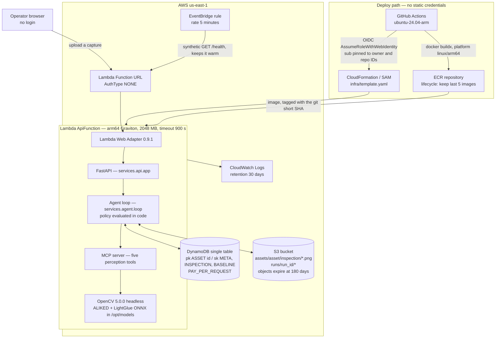

# afterimage — technical report

A visual inspection agent with longitudinal memory, built for the
[OpenCV AI Competition 2026](https://opencv26.devpost.com/) (Agentic Vision path).

**Live agent:** <https://jgmzrkpa344jwixw7nbulgh2ju0mojcb.lambda-url.us-east-1.on.aws/> — no login.
**Field manual:** <https://gmassello.github.io/afterimage/> · **Source:** <https://github.com/gmassello/afterimage>

This report is self-contained: problem, users, architecture, the OpenCV 5 implementation, the
agentic loop, the AWS deployment, what was measured and where it fails. Every number in it is either
produced by `make eval` and stored in `eval/results/latest/results.json`, read from a file in this
repository and cited with its path, or taken from a public source listed with its URL.

---

## 1. The problem, and who has it

A utility-scale photovoltaic plant is a field of near-identical objects that degrade slowly and
independently. Solar Star, in California, is 579 MW across roughly **1.7 million modules** — about
2,900 modules per MW.<sup>[1]</sup> At that ratio a modest 100 MW plant carries on the order of
290,000 individual assets, each of which can crack, delaminate, develop a hot spot or simply get
dirty, and each of which is worth a few hundred dollars.

The people who have this problem are plant O&M technicians and asset owners. Their working question
is not "is this module defective?" It is **"has this module changed since the last time we looked at
it?"** — because that is the question that separates a scratch that has been there since
commissioning from a crack that appeared last quarter and is spreading.

Existing automated inspection answers the first question. It classifies one frame in isolation
against a generic notion of a healthy panel. That is a fundamentally harder problem than the one the
technician actually has, and it throws away the single most informative thing available: what this
exact panel looked like three months ago.

## 2. Why change over time is the right thing to measure

The published failure literature describes degradation as a **curve, not an event**. A defect that
is harmless today is frequently the early state of one that is not:

| Failure mode | What the literature reports | Source |
|---|---|---|
| Cell microcracks | A crack separating **less than 8% of the cell area causes no immediate power loss** — but thermal and humidity cycling can raise the crack's resistance over time, turning a benign crack into a real one. Early classification is what distinguishes the two. | Köntges et al., 2011<sup>[2]</sup> |
| Potential-induced degradation (PID) | Mean degradation of about **15%/year in affected modules**. The curve is sigmoidal — slow, then fast, then saturating — and the damage is **partially reversible** if the plant intervenes before saturation. | IEA-PVPS T13-09:2017<sup>[3]</sup> |
| Cell cracks | Under 3%/year system-wide, but up to roughly **7–8%/year in the affected portion** in cold and snow-load climates. | IEA-PVPS T13-09:2017<sup>[3]</sup> |
| Delamination | **Power loss above 10%** where it occurs; about 5% of failures registered within two years of delivery. | IEA-PVPS T13-09:2017<sup>[3]</sup> |
| Failed bypass diode | 11%/year in hot-dry and 25%/year in moderate climates for affected modules. A shorted diode in a three-diode module removes **one third of its output**, and an open one is invisible until the module is shaded — at which point it can produce hot spots and a fire risk. | IEA-PVPS T13-09:2017<sup>[3]</sup> |
| Soiling | **5–20% annual energy loss depending on site.** Arizona measured −1.2% in a wet year against −3.6% in a dry one; a Saudi site lost 1.4%/year under weekly cleaning and up to 8% at once after a sandstorm. | IEA-PVPS T13-09:2017<sup>[3]</sup> |
| Overall module degradation | Median **0.5–0.6%/year**, mean 0.8–0.9%/year across the published corpus. | Jordan et al., 2016<sup>[4]</sup> |

Read together, these say the same thing four different ways: **the value of an observation is in its
delta against the previous observation of the same physical object.** A 15%/year PID curve caught
before saturation is recoverable; caught after, it is not. A microcrack under the 8% threshold is a
thing to watch, and "watch" is a longitudinal verb.

### What we did not find, and are not going to invent

We looked for a published figure quantifying the **money saved by early detection** and there is
none we could verify. The primary literature documents the mechanism — what happens to a defect left
alone — not the return on catching it. The only inspection-cost figures we found in accessible form
come from the blogs of vendors who sell inspection services, which is a conflict of interest, and
two NREL and EPRI cost reports we could identify but not open to verify line by line. **None of them
are cited here.** A fabricated ROI number would be the easiest thing in this report to disprove.

What we can state is our own measured cost, because we own those numbers: alignment runs in about
**1.5 s per image pair** on CPU, and the AWS account carrying this stack billed **$0.0138** in
August. afterimage itself adds on the order of **$1/month**, nearly all of it ECR storage for the
2 GB arm64 image — Lambda stays inside the perpetual free tier even with a warmer firing every five
minutes, which burns about 1,700 GB-s a month against 400,000 free.

<sub>
[1] Solar Star, 579 MW / ~1.7 million modules — <https://en.wikipedia.org/wiki/Solar_Star>. Press-grade
source, adequate for order of magnitude, not an engineering citation.<br/>
[2] M. Köntges, I. Kunze, S. Kajari-Schröder, X. Breitenmoser, B. Bjørneklett, "The risk of power loss
in crystalline silicon based photovoltaic modules due to micro-cracks", <i>Solar Energy Materials and
Solar Cells</i> 95(4):1131–1137, 2011 — <https://www.sciencedirect.com/science/article/abs/pii/S0927024810006606><br/>
[3] M. Köntges et al., IEA-PVPS T13-09:2017, "Assessment of Photovoltaic Module Failures in the
Field", May 2017 — <https://iea-pvps.org/wp-content/uploads/2017/09/170515_IEA-PVPS-report_T13-09-2017_Internetversion_2.pdf><br/>
[4] D. C. Jordan, S. R. Kurtz, K. VanSant, J. Newmiller, "Compendium of photovoltaic degradation
rates", <i>Prog. Photovolt: Res. Appl.</i> 24(7):978–989, 2016, as cited in IEA-PVPS T13-30:2025 —
<https://www.iea-pvps.org/wp-content/uploads/2025/02/IEA-PVPS-T13-30-2025-REPORT-Degradation-and-Failure.pdf>
</sub>

## 3. What makes this different: longitudinal memory

afterimage does not ask "does this look like a broken panel?" It asks **"what changed since the last
time I saw this exact panel?"**

Every capture is aligned to the stored baseline of the **same asset**, diffed against it, and the
result is written back as the new baseline once a human or the policy accepts it. Memory is not a
cache in front of a classifier — it is the reference the measurement is taken against. Remove it and
there is nothing to measure.

Concretely, in `services/memory/store.py`, one DynamoDB partition holds an asset's whole life:

| Sort key | What it is |
|---|---|
| `META` | the asset |
| `INSPECTION#{captured_at}#{inspection_id}` | one capture, the metrics measured on it, and the `verdict` it was judged by — the metric, the value and the **threshold in force when it ran**, so moving a threshold never relabels the past |
| `BASELINE#{captured_at}` | the current reference, gaining a `superseded_by` field when a newer one replaces it |

The baseline is a first-class item rather than a flag on an inspection, so fetching it is one small
read no matter how long the history is — and **the chain of superseded baselines is the longitudinal
record.** Nothing is overwritten; a baseline is retired, not edited.

No previous competition winner in this space kept state across inspections. Every prior project we
reviewed analyses one frame, or one session.

## 4. Architecture



One Lambda container image serves everything: the site, the upload, the approval queue, the asset
history and the trace viewer, with the agent loop running inside the request. There is no separate
inference service, no queue and no orchestrator — the loop is a function call, and the whole system
is one deployable artefact.

**API surface** (`services/api/app.py`):

| Route | Purpose |
|---|---|
| `GET /` | assets and the upload form |
| `POST /inspections` | upload a capture, open its trace, redirect to it |
| `POST /runs/{run_id}/execute` | run the agent loop for an opened trace |
| `GET /assets/{asset_id}` | the longitudinal history of one asset |
| `GET /queue` · `POST /queue/{run_id}/{approve\|reject}` | the human gate |
| `GET /traces/{run_id}` | the per-run trace, JSON or a readable page |
| `GET /static/{name}` | the stylesheet and the script, content-hashed and cached for a year |
| `GET /images/{key}` | stored captures, aligned images and masks |
| `GET /health` | liveness, and the target of the warmer |

## 5. The OpenCV 5 implementation

Five tools, each returning **numeric metrics and no verdict at all**. This separation is the
foundation of everything in section 6: thresholds live in the policy, so an OpenCV value visibly
changing a decision is a fact you can point at rather than something inferred from a prompt.

| Tool | OpenCV 5 primitives | Metrics returned |
|---|---|---|
| `assess_quality` | `cv2.Laplacian(..., CV_64F).var()`, `cv2.Canny` + `cv2.findContours` + `cv2.boundingRect` | `blur_variance`, `mean_brightness`, `clipped_dark_ratio`, `clipped_bright_ratio`, `coverage_ratio` |
| `align_to_baseline` | `cv2.ALIKED.create` + `cv2.LightGlueMatcher.create` (neural) or `cv2.ORB.create(4000)` + `cv2.BFMatcher(NORM_HAMMING)` (fallback); `cv2.findHomography(..., cv2.USAC_MAGSAC, 3.0)`; `cv2.warpPerspective`; `cv2.erode` | `keypoints_query`, `keypoints_train`, `matches`, `inliers`, `inlier_ratio`, `mean_reprojection_error` |
| `diff_against_memory` | `cv2.createCLAHE`, `cv2.absdiff`, `cv2.GaussianBlur`, `cv2.threshold`, `cv2.connectedComponentsWithStats` | `changed_ratio`, and per region `area_px`, `area_ratio`, `mean_delta`, `bbox` |
| `crop_and_rescan` | the same diff pipeline plus `cv2.resize(..., INTER_CUBIC)` | the same fields, measured on the upscaled crop |
| `classify_severity` | `cv2.cvtColor(..., COLOR_BGR2HSV)`, `cv2.absdiff` | `score` and the features `brightness_delta`, `saturation_delta`, `hue_shift`, `spatial_uniformity`, `mean_delta`, `area_ratio` |

The `Features` module is used substantively, not decoratively: ALIKED keypoints matched by LightGlue
are what anchor a capture to the baseline of the same asset, and without that anchoring the diff in
the next step is meaningless.

### Three things measured against the binary, not the documentation

OpenCV 5 broke compatibility with 4.x and model training data covers 4.x, so every API here was
verified against a running `5.0.0` build on `aarch64`.

- **`AKAZE`, `KAZE` and `BRISK` moved to contrib** and are not in the headless wheel. ALIKED and
  LightGlue need two external ONNX files (52 MB), downloaded and sha1-verified by `make weights`.
- **`inlier_ratio` is not comparable across detectors.** On the same pair of images — same panel,
  rotated and scaled — ALIKED + LightGlue reports **0.997** where ORB reports **0.409**, because a
  repetitive cell grid produces ambiguous ORB matches. A single shared threshold would make the
  fallback detector declare "unrecognised asset" on every retry. The policy therefore carries
  **one threshold per detector**: `inlier_ratio_min_neural=0.90`, `inlier_ratio_min_classic=0.30`.
- **`warpPerspective` leaves black wherever the homography did not reach**, and the diff read that
  border as the largest change in the frame — 8.96% of it, burying a cracked cell of area 2,923
  under a border blob of area 18,010 and turning `classify_severity` from `crack` into `unknown`.
  This is not a test artefact: any badly framed recapture produces it, and it inflates the exact
  metric the policy branches on. The fix lives where every caller routes through — `align_to_baseline`
  warps a white mask with the same homography, erodes it by 9 px (more than the diff's blur radius)
  and hands it to `diff_against_memory`, which then finds a single region: the cracked cell.

The DNN engine in OpenCV 5 has no GPU support, so the whole system is designed for CPU on arm64
Graviton from the first commit. Nothing here needs CUDA.

## 6. The agentic loop


### Where autonomy actually lives

Four branches change what the system *does*, not just what it reports:

1. **Ask for a recapture** when the image is unusable — the operator is still on site.
2. **Retry with a different detector**, and only declare the asset unrecognised if the classical one
   also fails. One bad neural match is not a conclusion.
3. **Zoom in on its own initiative.** When a change is detected but too weak to be confident about,
   the agent re-measures that region alone at 4× the pixel count before deciding. This is the branch
   where the agent chooses to gather more evidence rather than guess.
4. **Stop and ask a human** when severity crosses the approval threshold. Nothing is written to
   memory until a person answers.

### Why the LLM cannot cheat

The award's bar is that a visual result must change a subsequent action, and that a judge should see
it without inferring. So the causal link is a **field**, not a reconstruction:

```json
{"input_metric": "inlier_ratio", "value": 0.0385, "threshold": 0.3, "branch": "unrecognized_asset"}
```

Every tool result passes through `policy.evaluate(stage, metrics, policy)` **in code, agent-side**,
before the model ever sees it. The verdict is recorded and then injected into the function response.
The model orchestrates the calls and phrases the operator message; it does not decide anything:

- a `submit` naming a branch other than the one the policy computed comes back as an error tool
  result naming the mandated branch (`services/agent/loop.py:220-227`);
- a `submit` bundled with other calls in the same turn is discarded as premature;
- calling a tool out of sequence is rejected against the expected next tool;
- and the run fails outright rather than guessing if no valid submit arrives within 12 turns.

The full policy, with every default:

| Threshold | Default | Metric compared | Stage |
|---|---:|---|---|
| `blur_variance_min` | 100.0 | `blur_variance` | quality |
| `mean_brightness_min` / `_max` | 40.0 / 220.0 | `mean_brightness` | quality |
| `clipped_ratio_max` | 0.30 | `clipped_dark_ratio`, `clipped_bright_ratio` | quality |
| `coverage_ratio_min` | 0.0 — **deliberately disabled**, see §8 | `coverage_ratio` | quality |
| `inlier_ratio_min_neural` | 0.90 | `inlier_ratio`, ALIKED + LightGlue | alignment |
| `inlier_ratio_min_classic` | 0.30 | `inlier_ratio`, ORB | alignment |
| `mean_delta_confirm` | 35.0 | `mean_delta` of the top region | diff |
| `rescan_area_ratio_min` | 0.02 | `area_ratio` after the zoom | rescan |
| `severity_score_approve` | 0.40 | `score` | severity |

Each is overridable per deployment through `AFTERIMAGE_<FIELD>` environment variables. They are
values in one frozen dataclass (`services/agent/policy.py`), not constants scattered through the
perception code — which is what makes recalibrating for a site a configuration change.

### Observability

Every tool call emits one span into `runs/{run_id}/events.json` carrying its arguments, the metrics
it returned, its duration and the policy verdict the value triggered. `GET /traces/{run_id}` serves
it as JSON or as a readable page. Traces persist in S3, so they survive redeploys and cold sandboxes.

Two live traces, both on the deployed endpoint. The first is the zoom branch; the second is the run
shown in the video, where an OpenCV number stopped the loop and a person restarted it:

- <https://jgmzrkpa344jwixw7nbulgh2ju0mojcb.lambda-url.us-east-1.on.aws/traces/90472757e472>
- <https://jgmzrkpa344jwixw7nbulgh2ju0mojcb.lambda-url.us-east-1.on.aws/traces/8bb9b7d00eb1>
  — `score 0.6798 >= 0.4 -> human_approval`, then `human_approved 1.0 >= 1.0 -> approved`

## 7. Deployment and responsible operation

| Concern | How it is handled |
|---|---|
| Compute | One Lambda container image, `arm64` Graviton, 2048 MB, 900 s timeout, behind a Function URL |
| Reproducibility | Exact pins in `requirements.txt`; image tagged with the git short SHA; `make weights` sha1-verifies the two ONNX files |
| Infrastructure as code | `infra/template.yaml` (SAM) and `infra/github-oidc.yaml`; `make deploy` and the GitHub Actions workflow run the same `deploy.sh` |
| Deploy credentials | **None stored.** GitHub Actions federates over OIDC; the trust policy pins `sub` to the immutable numeric owner and repo IDs, not to names that can be transferred |
| Blast radius | A permissions boundary caps the deploy role at this stack's own table, bucket and logs; role creation is only permitted with that boundary attached, and `iam:PassRole` only to Lambda |
| Image retention | ECR lifecycle policy keeps the last 5 images |
| Data retention | S3 objects expire at 180 days; incomplete multipart uploads at 7; CloudWatch Logs at 30 days |
| Cost | The account billed $0.0138 in August; this stack adds roughly $1/month, nearly all ECR storage. The 5-minute warmer burns ~1,700 GB-s against 400,000 free, so Lambda itself stays inside the perpetual free tier |

### Responsible use

- **The endpoint is public and unauthenticated by design** — the competition requires a judge to use
  it without an account. Uploads are capped at 6 MB, `asset_id` and `run_id` are pattern-validated
  before touching storage, and everything uploaded expires at 180 days. It should be treated as a
  demonstrator: anything uploaded is visible to anyone with the URL.
- **The human gate is real, not decorative.** On `HUMAN_APPROVAL` the run stops at
  `awaiting_approval` and **nothing is committed to memory** until a person resolves it. Approval and
  rejection are both recorded.
- **The agent assists an inspection; it does not sign one off.** It reports what changed, how much,
  and the number that made it say so. Every decision is reconstructible from its trace. A defect
  classification here is a prioritisation signal for a technician, not a certification of a module's
  condition.
- **Model behaviour is bounded by construction.** Branch verdicts are computed in code, so the
  system's decisions do not depend on the model provider, its version, or prompt phrasing.

## 8. Evaluation

Full method, dataset, failure analysis and limits: **[`docs/EVALUATION.md`](EVALUATION.md)**.
Regenerate everything with `make eval`.

**23 scenarios** — 11 synthetic and 12 built on licensed Wikimedia Commons photographs of real
photovoltaic modules, committed to the repository with per-file attribution. **20 passed** every
assertion. The harness runs the real loop, the real MCP tools and the real thresholds, substituting
only the language model for a scripted driver, so the table is identical on every run with no
network and no tokens.

| Metric | Value |
|---|---|
| Branch accuracy | **0.8696** · macro F1 **0.8815** |
| Defect classification accuracy | **0.9524** · macro F1 **0.9513** |
| Mean IoU of the located region | **0.8258**, 9 of 10 at IoU ≥ 0.5 |
| `human_approval` precision | **1.0** — a human was never called for nothing |

`eval/tests/test_published_numbers.py` parses this page and `docs/EVALUATION.md` and fails the suite
if either disagrees with `eval/results/latest/results.json`. A number here cannot go stale silently.

### Two open questions the evaluation closed

Both were annotated in the code, waiting for measurement rather than opinion.

**The severity heuristic holds.** `services/perception/severity.py` classifies defects with
thresholds over OpenCV features and carried a note to replace it with a trained classifier if the
classes failed to separate. They separate: macro F1 0.9513 with **precision 1.0 on all four defect
classes**, and the single recall miss is an exposure gate firing first, not a confusion between
classes. No classifier is warranted, and that is now a measured conclusion.

**Frame-coverage checking cannot be enabled with a global default.** Real photographs gave the first
honest reading of `coverage_ratio`, and the result was worse than "synthetic images are
unrepresentative": perfectly healthy real captures span **0.0032 to 0.6357**, a 200-fold spread,
while a good synthetic panel reads 0.0009. The metric tracks how much contrast the largest contour
encloses, which depends on a site's framing and background far more than on whether the panel is in
frame. The default stays 0.0 and it is documented as a per-deployment setting with 0.0032 as the
measured floor.

### Where it fails

Three scenarios, kept and analysed rather than tuned away.

| Scenario | Expected | Got | The number that decided it |
|---|---|---|---|
| Partially framed panel | recapture | unrecognized_asset | `inlier_ratio` 0.0602 vs 0.30 |
| Hot spot on a bright photograph | human_approval | recapture | `clipped_bright_ratio` 0.3086 vs 0.30 |
| Delamination over a small area | human_approval | auto_write | `score` 0.3412 vs 0.40 |

The third is the one that matters, because it is structural rather than a mis-set threshold:
`score` is `mean_delta / 64.0` and **ignores the label the classifier just produced**. The classifier
is confident enough to say "delamination" and the score does not consult that at all. Raising the
threshold would not fix it; making the score class-aware would. That change is deliberately not made
on the strength of one scenario — rewriting a scoring function to satisfy a single failing case is
the overfitting this dataset exists to prevent.

## 9. Limitations

Written as they were measured, not assembled at the end.

- Defect classification is a threshold heuristic over OpenCV features, not a trained classifier —
  measured, not assumed, at macro F1 0.9513.
- `severity.score` ignores the classifier's label, so a defect over a small area can be written
  automatically. Observed once, at 0.3412 against a 0.40 threshold.
- `crop_and_rescan` re-measures the same capture at higher resolution. It buys measurement precision
  on a marginal region, **not new optical detail** — it cannot resolve what the capture never
  recorded.
- `inlier_ratio` is not comparable across detectors, so the policy needs one threshold per detector.
- Frame coverage is estimated from the bounding box of the largest edge contour and will misread
  panels against cluttered backgrounds. The check is off by default for that reason.
- `mean_delta_confirm=35` leaves the zoom branch a **two-point-wide window**: injected changes
  measuring 33.34 and 34.37 enter it, 35.54 skips it. Narrow, but reproducible on demand — and
  reproduced against the public endpoint.
- Alignment costs about 1.5 s per pair on CPU, and OpenCV 5's DNN engine has no GPU support.
- The evaluation injects its defects. That is what makes ground truth exact, and it means the numbers
  describe threshold robustness on real photographic texture, not field detection rates. No public
  dataset offers what the longitudinal claim needs: the same physical panel photographed twice.
- 23 scenarios is a small sample — one scenario moves accuracy by 4.3 points.
- Tests and the default demo drive the loop with a scripted policy-following model; `--live` runs the
  same loop against Gemini. Branch verdicts are computed in code either way.

## 10. Reproducing this

```bash
make weights   # the two ONNX files, 52 MB, sha1 verified
make dev       # arm64 container + LocalStack (S3 + DynamoDB)
make test      # the suite, inside the container
make demo      # drive all four action branches locally
make eval      # regenerate every number in section 8
```

Or use the deployed agent directly: upload a capture at the public URL, watch the loop decide, read
the trace, resolve the approval at `/queue`, and see both inspections in the asset's history.
